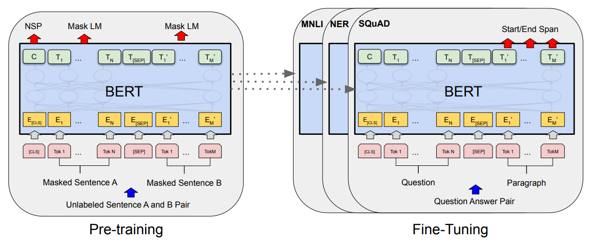
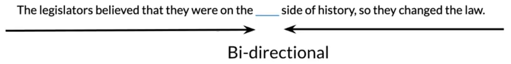
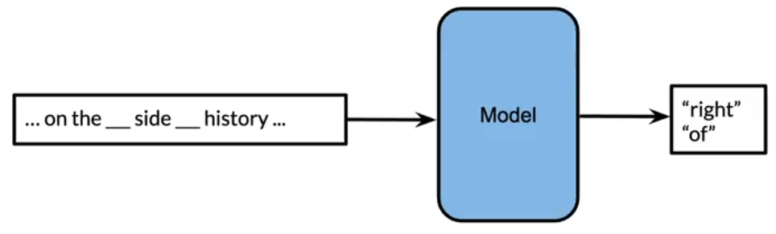
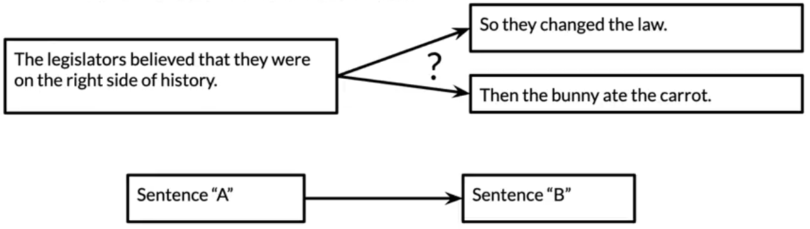
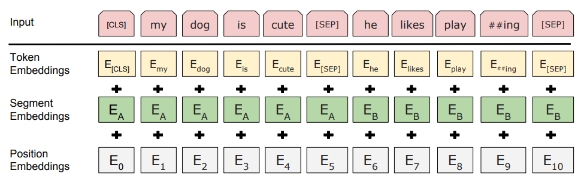

# BERT: Pre-training for Deep Bidirectional Transformers for Language Understanding 

  
   
  <figcaption>Figure 1: BERT procedures</figcaption>

 

## BERT Objective

  
   
  <figcaption>Figure 2: Bi-directional example</figcaption>

### 1. Multi-Mask Language Modeling

  
   
  <figcaption>Figure 3: Multi-Mask Language Modeling</figcaption>

Loss: Cross-entropy loss

### 2. Next Sentence Prediction

  
   
  <figcaption>Figure 4: Next Sentence Prediction</figcaption>

Loss: Binary loss

### Downstream Tasks
- Question Answering (QA)
- Natural Language Inference (NLI)

## BERT Input Representation

  
   
  <figcaption>Figure 5: BERT input representation</figcaption>

The input embeddings are the sum of three embeddings

- **token embeddings**: there are `CLS` token to indicate the beginning of the sentence and `SEP` token to indicate the end of the sentence
	- [CLS]: a special classification token added in front of every input
	- [SEP]: a sepcial separator token
- **segment embeddings**: it allows to indicate whether it sentence `A` or `B`
- **position embeddings**: it allows to indicate the word's position in the sentence

 

# Pre-training BERT

## 1. Masking Strategy: Masked LM
To avoid overfitting to `[MASK]` token and to generalize better to unmasked input during fine-tuning.

Choose 15% of the tokens at random

- 80% `[MASK]`: learn to predict missing words
- 10% **random word**: add noise so model doesn't overfit
- 10% **original token**: teach model to handle natural context

## 2. Next Sentence Prediction

To train the model to understand **sentence relationships**.

Choose 50% of the time sentence `B` randomly (label:0, not next) and 50% actual next sentence that follows sentence `A` (label: 1, is next).

# References

- https://arxiv.org/abs/1810.04805
- https://huggingface.co/docs/transformers/en/model_doc/bert