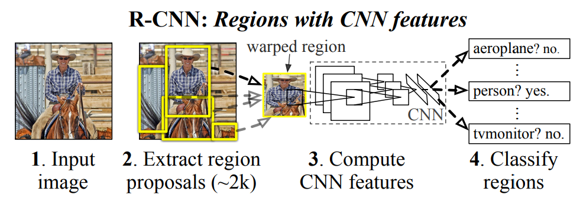

# Rich feature hierarchies for accurate object detection and semantic segmentation

  
   
  <figcaption>Figure 1: R-CNN architecture</figcaption>

 

# References

- https://arxiv.org/abs/1311.2524 