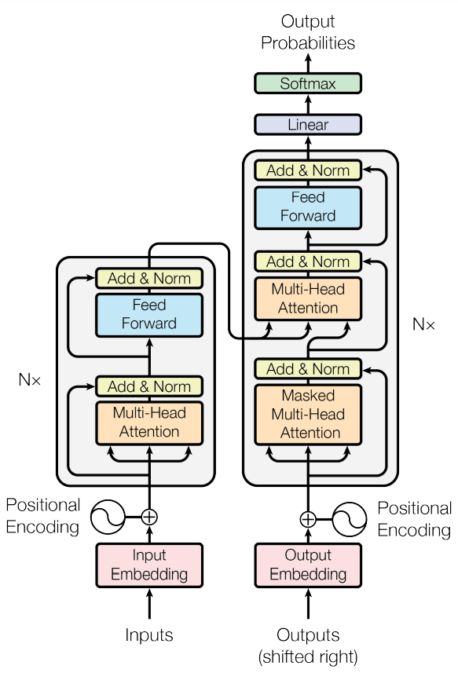

# Transformer

## Positional Encoding
$$PE_{(pos, 2i)} = sin(pos/10000^{2i/d_{model}})$$
$$PE_{(pos, 2i + 1)} = cos(pos/10000^{2i/d_{model}})$$

where, $pos$ is the position and $i$ is the dimension

## Position-wise Feed-Forward Networks
$$FFN(x) = max(0, xW_1 + b_1)W_2 + b_2$$

There is $RELU$ activation in between, with $d_{model}$ = 512, $d_{ff}$ = 2048

 (batch, seq_len, d_model) -> (batch, seq_len, d_ff) -> (batch, seq_len, d_model)

# References
[Attention is all you need](https://arxiv.org/abs/1706.03762)