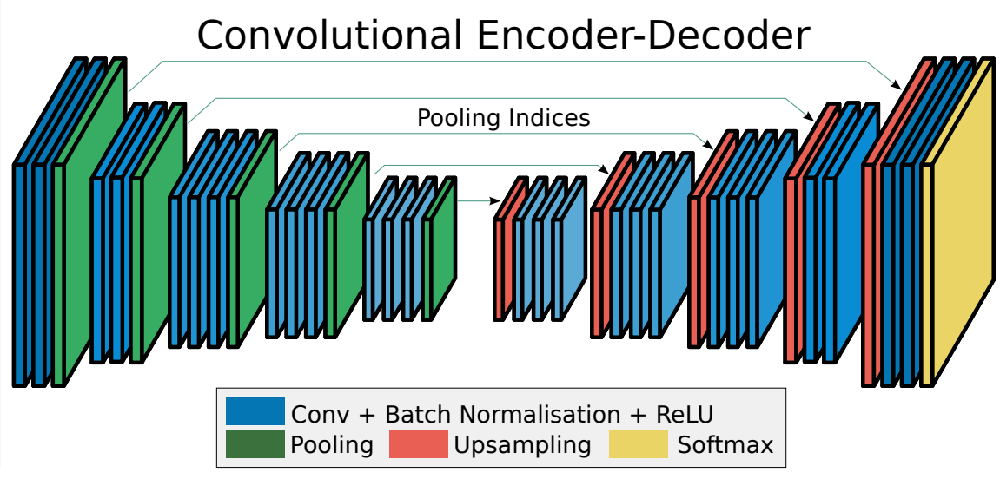

# SegNet: A Deep Convolutional Encoder-Decoder Architecture for Image Segmentation 

## Architectures

  
   
  <figcaption>Figure 1: SegNet Architecture</figcaption>

# Training

- Dataset: The Cambridge Driving (CamVid) (https://github.com/divamgupta/image-segmentation-keras)

# References

- https://arxiv.org/abs/1511.00561 