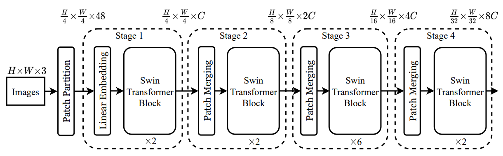
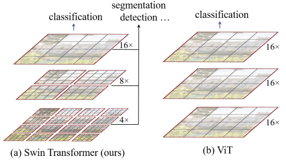
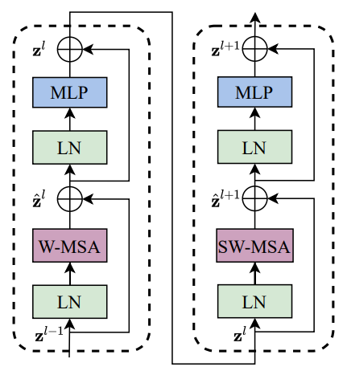
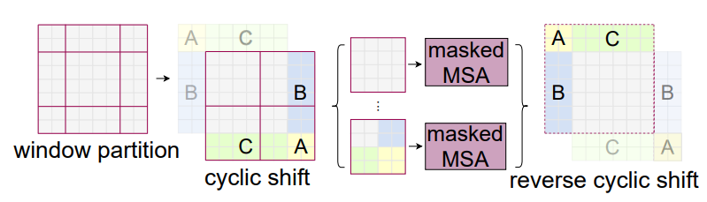

# Swin Transformer: Hierarchical Vision Transformer Using Shifted Windows

<div align="center">

  
  <br/>
  <figcaption>Figure 1: Swin Transformer architecture</figcaption>

</div>

</br>

<div align="center">

  
  <br/>
  <figcaption>Figure 2: Image Patches</figcaption>

</div>

Patch (gray square)
- a squre region of the input image

Token (inside gray square)
- the vector representation of a patch
- after the `Patch Partition` layer, each patch becomes a token: a vector of length `d_model`

Window (red square)
- a grid of patch tokens
- attention is applied within each window


</br>

# Swin Transformer Block

<div align="center">

  
  <br/>
  <figcaption>Figure 3: Swin Transformer Block</figcaption>

</div>


## Window Partition & Reverse

group tokens in to windows to apply local attention

- outer dims: how many windows you have (H // window_size, W // window_size)
- inner dims: shape of each window (window_size, window_size)
- num windows: (H // window_size) * (W // window_size)


(B, H, W, C) -> (B * num_windows, window_size * window_size, C) -> (B, H, W, C)


<div align="center">

  
  <br/>
  <figcaption>Figure 4: Window Partitioning</figcaption>

</div>

example:

8x8 grid tokens with 4x4 window size
```
Window Layout:
  ┌────────────┬────────────┐
  │  A A A A   │  B B B B   │
  │  A A A A   │  B B B B   │
  │  A A A A   │  B B B B   │
  │  A A A A   │  B B B B   │
  ├────────────┼────────────┤
  │  C C C C   │  D D D D   │
  │  C C C C   │  D D D D   │
  │  C C C C   │  D D D D   │
  │  C C C C   │  D D D D   │
  └────────────┴────────────┘
```

(B, 8, 8, C) -> (B * 4, 16, C) {partition} -> (B, 8, 8, C) {reverse}

</br>

## Patch Merging
Swin Transformer's version of downsampling: reducing spatial dimensions while increasing the feature dimension (like pooling + channel expansion in CNNs)

## Residual Connection & Pre-Norm

1. Self-Attention with Residual Connection

$$x = x + Dropout(MultiHeadAttention(LayerNorm(x)))$$

2. Feed-Forward Network with Residual Connection

$$x = x + Dropout(FeedForward(LayerNorm(x)))$$

# References

- https://arxiv.org/abs/2103.14030
- https://huggingface.co/docs/transformers/en/model_doc/swin
