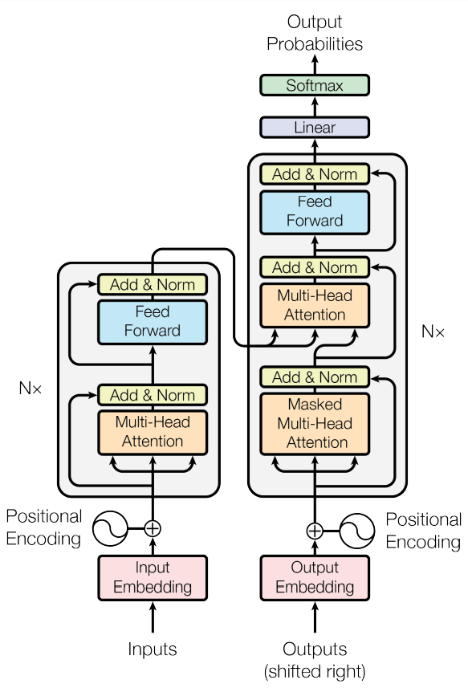

# Transformer: Attention is all you need

## Architecture

  
   
  <figcaption>Figure 1: The Transformer - model architecture</figcaption>

## Positional Encoding

$$PE_{(pos, 2i)} = sin(pos/10000^{2i/d_{model}})$$
$$PE_{(pos, 2i + 1)} = cos(pos/10000^{2i/d_{model}})$$

where, $pos$ is the position and $i$ is the dimension

## Attention

- seq : sequence length
- $d_{model}$ : size of the embedding vector
- h : number of heads
- $d_k$ = $d_v$ : $d_{model}$ / h

### Scaled Dot-Product Attention

  
   
  <figcaption>Figure 2: Scaled Dot-Product Attention mechanism</figcaption>

$$Attention(Q, K, V) =  softmax(\frac {QK^T} {\sqrt {d_k}}) V$$

### Multi-Head Attention

$$MultiHead(Q, K, V) = Concat(head_1, \dots, head_h)W^o$$

where, $head_i = Attention(QW^q_i, KW^k_i, VW^v_i)$

## Position-wise Feed-Forward Networks

$$FFN(x) = max(0, xW_1 + b_1)W_2 + b_2$$

There is $RELU$ activation in between, with $d_{model}$ = 512, $d_{ff}$ = 2048

(batch, seq_len, d_model) -> (batch, seq_len, d_ff) -> (batch, seq_len, d_model)

## Residual Connection & Post-Norm

1. Self-Attention with Residual Connection

$$x = LayerNorm(x + Dropout(MultiHeadAttention(x))))$$

2. Feed-Forward Network with Residual Connection

$$x = LayerNorm(x + Dropout(FeedForward(x)))$$

## Dropout
Dropout is applied in 3 places
### Encoder Block
$$x = x + Dropout(MultiHeadAttention(x))$$

$$x = LayerNorm(x)$$

Includes inner dropout after ReLU in FeedForwardBlock
$$x = x + Dropout(FeedForward(x))$$  

$$x = LayerNorm(x)$$

### Embeddings
$$x = Embedding(tokens) + PositionalEncoding$$

$$x = Dropout(x)$$

# Training

Dataset: [Huggingface opus_books](https://huggingface.co/datasets/Helsinki-NLP/opus_books)

# References

- https://arxiv.org/abs/1706.03762
