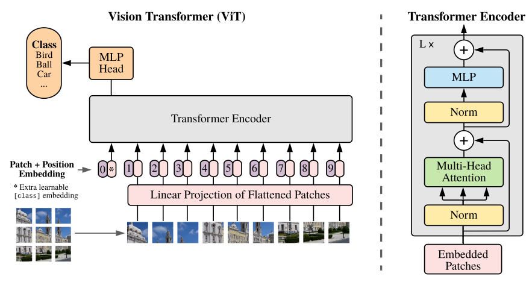

# ViT: Transformer for Image Recognition at Scale

  
   
  <figcaption>Figure 1: Vision Transformer architecture</figcaption>

## Residual Connection & Pre-Norm

1. Self-Attention with Residual Connection

$$x = x + Dropout(MultiHeadAttention(LayerNorm(x)))$$

2. Feed-Forward Network with Residual Connection

$$x = x + Dropout(FeedForward(LayerNorm(x)))$$

# Training

- Dataset: CIFAR-10

# References

- https://arxiv.org/abs/2010.11929 
- https://huggingface.co/docs/transformers/en/model_doc/vit
