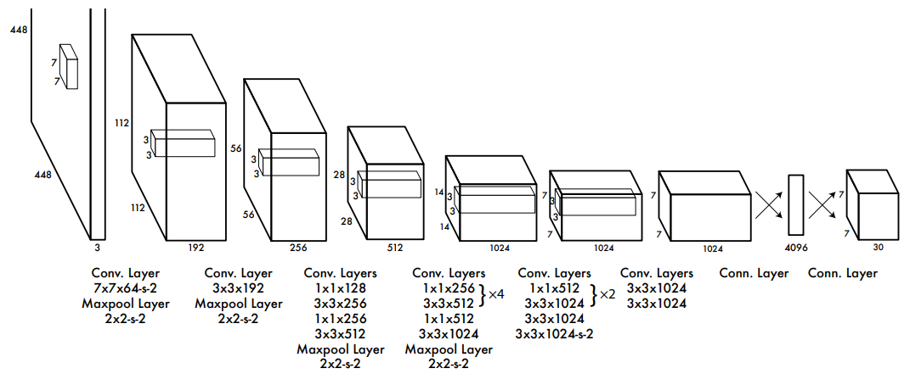

#  You Only Look Once: Unified, Real-Time Object Detection 

  
   
  <figcaption>Figure 1: YOLOv1 architecture</figcaption>

 

## Grid Cell (local detector)
- The image is divide into `S * S` grid cells (S: grid size)
- Each grid is responsible for **detecting objects whose centers fall within it** 
- Each grid cell predicts `B` **bounding boxes** (B: number of bounding boxes)
- Each grid cell also predicts `C` **class probabilities** (C: number of classes)

The total numbers predicted per grid cell: `B * 5 + C`
- B * (x, y, w, h, confidece) = B * 5 values

## Bounding Box
- `x, y`: center coordinates relative to the cell
- `w, h`: width & height relative to image
- `confidence`: 
    - score: pr(object) * IoU(pred, truth)
	- high if an object exists and the predicted box is accurate

output shape: (batch, S, S, B * 5 + C)

# Loss Function

### 1. Localization Loss (only for boxes responsible for objects)

- Penalizes differences in box coordinates (`x, y, w, h`)

$$\lambda_{coord}\sum_{i=0}^{S^2}\sum_{j=0}^{B} 1_{ij}^{obj}[(x_i - \hat x_i)^2 + (y_i - \hat y_i)^2] + \lambda_{coord}\sum_{i=0}^{S^2}\sum_{j=0}^{B} 1_{ij}^{obj}[(\sqrt {w_i} - \sqrt{\hat w_i})^2 + (\sqrt {h_i} - \sqrt{\hat h_i})^2]$$

### 2. Confidence Loss

- How confident the model is about object presence in a box
	- Object confidence loss
	- No-object confidence loss

$$\sum_{i=0}^{S^2}\sum_{j=0}^{B} 1_{ij}^{obj}(C_i - \hat C_i)^2 + \lambda_{noobj}\sum_{i=0}^{S^2}\sum_{j=0}^{B} 1_{ij}^{noobj}(C_i - \hat C_i)^2$$

### 3. Classification Loss

- Only for cells **containing an object**, penalizes class prediction error

$$\sum_{i=0}^{S^2} 1_{ij}^{obj} \sum_{c \in classes}(p_i(c) - \hat p_i(c))^2$$

## Full Loss Equation

$$Loss = \lambda_{coord}\sum_{i=0}^{S^2}\sum_{j=0}^{B} 1_{ij}^{obj}[(x_i - \hat x_i)^2 + (y_i - \hat y_i)^2] + \lambda_{coord}\sum_{i=0}^{S^2}\sum_{j=0}^{B} 1_{ij}^{obj}[(\sqrt {w_i} - \sqrt{\hat w_i})^2 + (\sqrt {h_i} - \sqrt{\hat h_i})^2]$$
$$ + \sum_{i=0}^{S^2}\sum_{j=0}^{B} 1_{ij}^{obj}(C_i - \hat C_i)^2 + \lambda_{noobj}\sum_{i=0}^{S^2}\sum_{j=0}^{B} 1_{ij}^{noobj}(C_i - \hat C_i)^2 + \sum_{i=0}^{S^2} 1_{ij}^{obj} \sum_{c \in classes}(p_i(c) - \hat p_i(c))^2$$

Where:

- $1_{ij}^{obj}$: 1 if object is in cell $i$, and box $j$ is responsible
- $\lambda_{coord}=5, \lambda_{noobj}=0.5$ (default values)

# References

- https://arxiv.org/abs/1506.02640