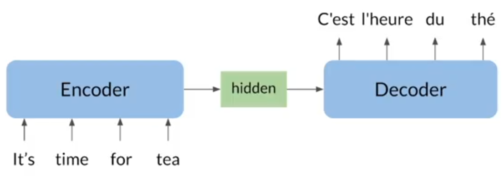
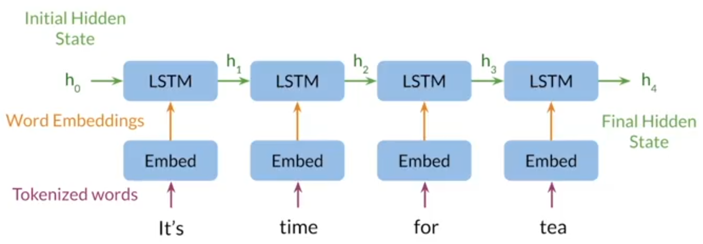
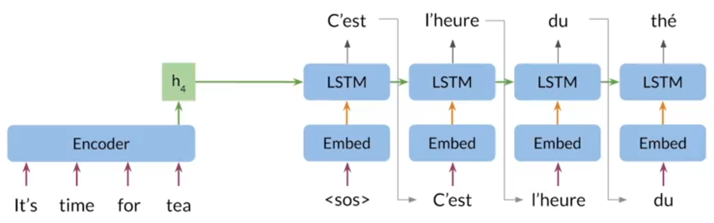
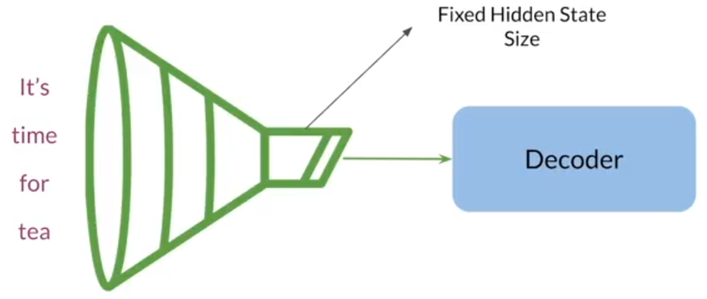

# Sequence to Sequence Learning with Neural Networks 

  
   
  <figcaption>Figure 1: seq2seq model</figcaption>

 

- Encoder and decoder architecture
- Maps variable-length sequence to fixed-length memory
- Inputs and outputs can have different lengths
- LSTMs and GRUs to avoid vanishing and exploding gradient problems

## Encoder

  
   
  <figcaption>Figure 2: seq2seq encoder</figcaption>

- At each step, the LSTM module receives an input senquence from the embedding layer as well as the hidden state from previous step

- At final step, it returns a hidden state which has information of the whole sentence, encoded its overall meaning

## Decoder

  
   
  <figcaption>Figure 3: seq2seq decoder</figcaption>

- It starts with a start of sequence `[SOS]` token

## Information Bottleneck

  
   
  <figcaption>Figure 4: seq2seq bottleneck</figcaption>

- A fixed amount of information goes from the encoder to the decoder, no matter how much information contained in the input sequence
- As sequence size increases, model performance decreases

# References

- https://arxiv.org/abs/1409.3215